Dokumentasi API CRUD dengan Laravel dan Swagger

**Instalasi L5 Swagger**

1.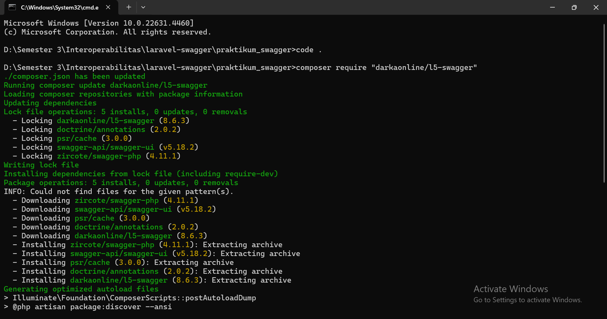

2. 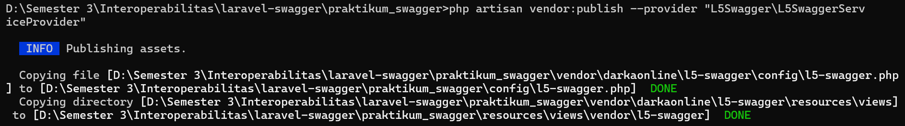

3. 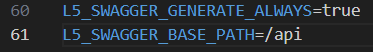

**Membuat Database dan Model**

1. 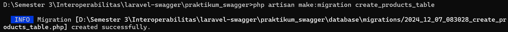
2. 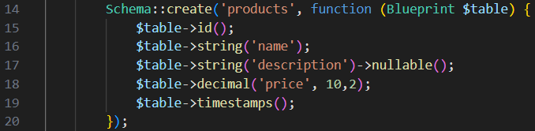
3. 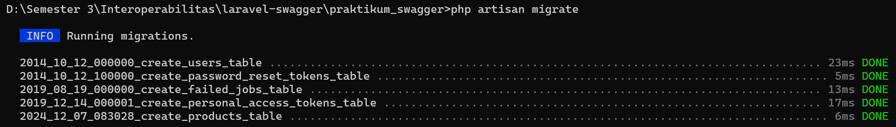
4. 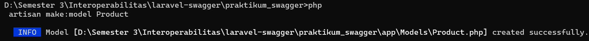

**Membuat Controller dengan CRUD**
1. 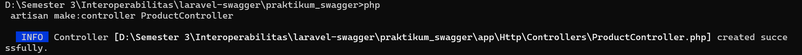
2. 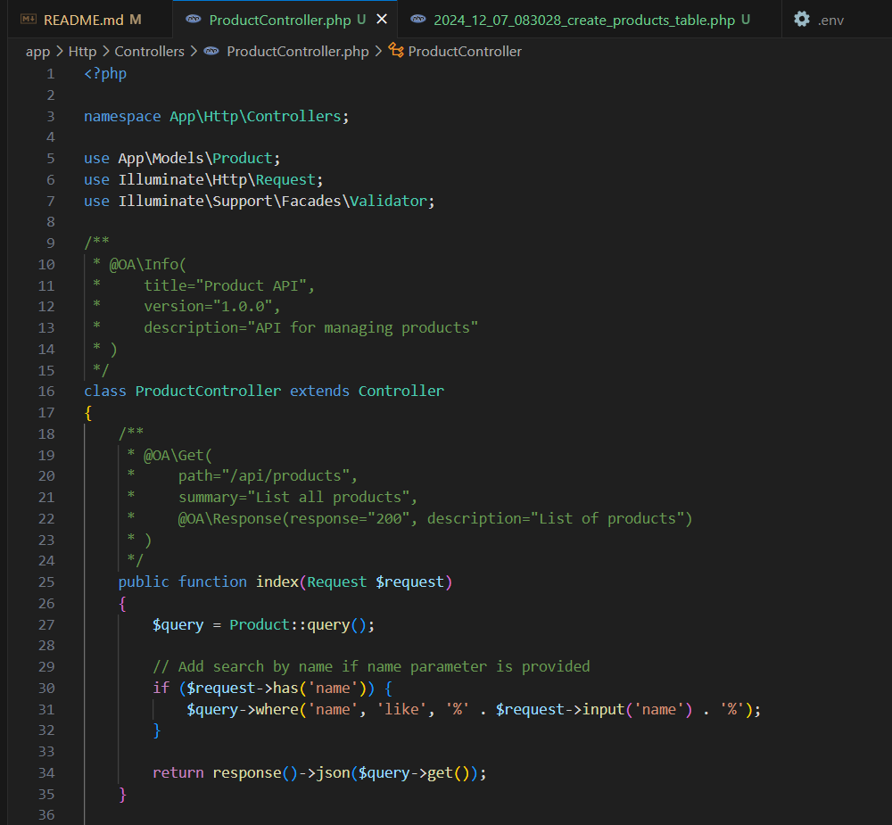

**Tambahkan Routes**
1. 

**Generate dan Akses Dokumentasi Swagger**
1. 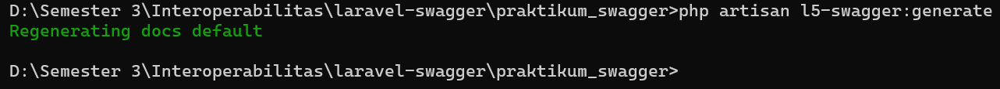
1. 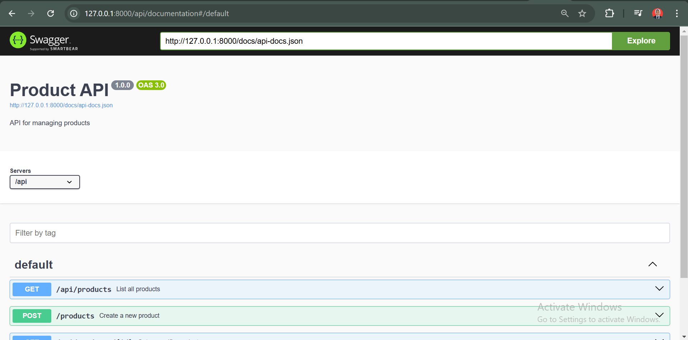

**Tugas Praktikum**

1. Tambahkan validasi untuk memastikan harga produk tidak boleh negatif.
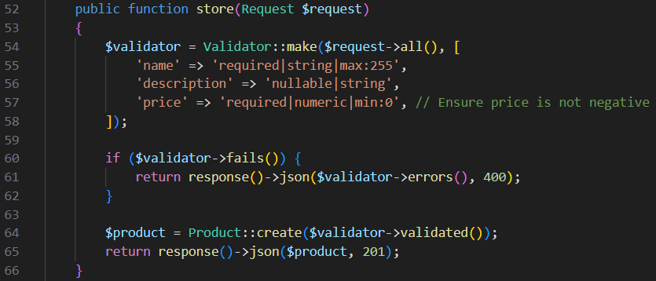
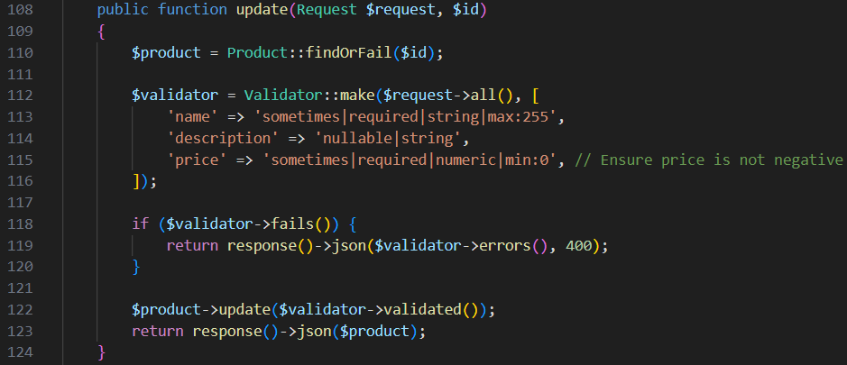

2. Tambahkan fitur pencarian produk berdasarkan nama ('GET /api/products?name=...').
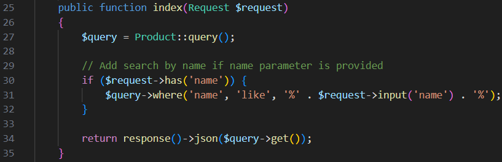

3. Buat dokumentasi Swagger untuk endpoint pencarian tersebut.
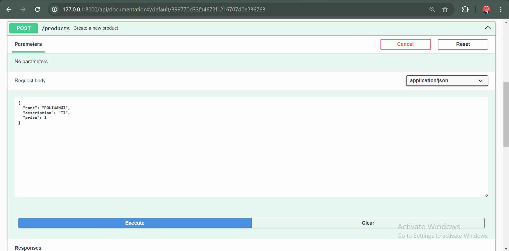
