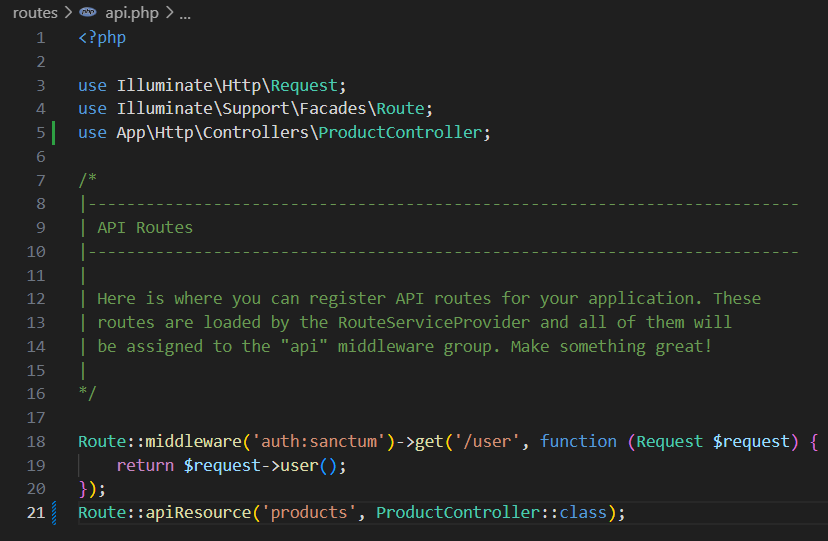

Dokumentasi API CRUD dengan Laravel dan Swagger

1. Instalasi L5 Swagger
1. 
2. 
3. 

2. Membuat Database dan Model
1. 
2. 
3. 
4. 

3. Membuat Controller dengan CRUD
1. 
2. 

4. Tambahkan Routes
1. 

5. Generate dan Akses Dokumentasi Swagger
1. 
2. 

Tugas Praktikum
1. Tambahkan validasi untuk memastikan harga produk tidak boleh negatif.
